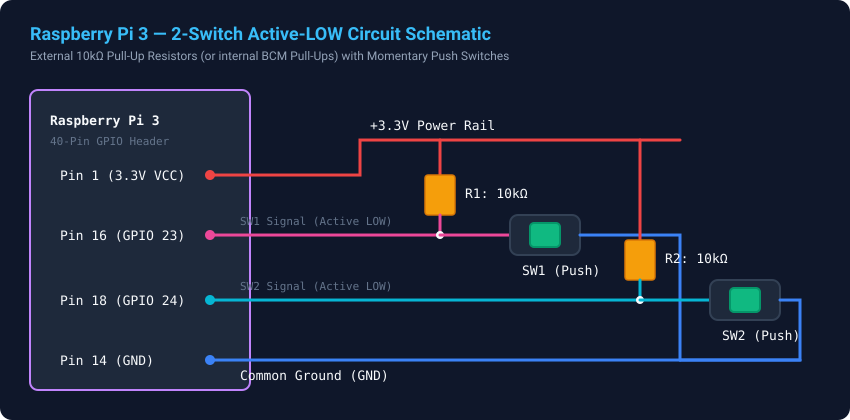
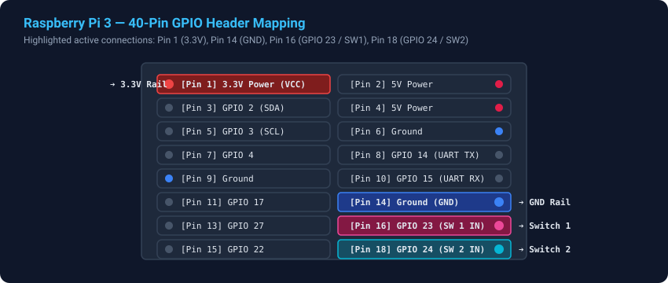

# 🔌 Raspberry Pi 3 Hardware Telemetry with Rust & gRPC

[](https://www.rust-lang.org/)
[](https://github.com/hyperium/tonic)
[](https://www.raspberrypi.com/)
[](LICENSE)

A minimal, robust hardware-to-client telemetry project: a **Raspberry Pi 3** monitors **2 input push switches** (with pull-up resistors & software debounce) and streams real-time switch transitions and diagnostic logs over **gRPC** to a **Rust debug receiver / client**.

---

## 📑 Table of Contents

1. [System Architecture](#-system-architecture)
2. [Hardware Circuit & Wiring](#-hardware-circuit--wiring)
3. [gRPC API Contract](#-grpc-api-contract)
4. [Project Structure](#-project-structure)
5. [Quickstart: Local Testing (Simulation Mode)](#-quickstart-local-testing-simulation-mode)
6. [Deploying to Raspberry Pi 3](#-deploying-to-raspberry-pi-3)
7. [Obsidian Vault Notes](#-obsidian-vault-notes)

---

## 🏗 System Architecture

```
  +-------------------------------------------------------------+
  |              Raspberry Pi 3 (Linux / BCM2837)               |
  |                                                             |
  |   [ Switch 1 ] ──> GPIO 23 (Pin 16) ──> Active-LOW (Pull-Up)|
  |   [ Switch 2 ] ──> GPIO 24 (Pin 18) ──> Active-LOW (Pull-Up)|
  |                                                             |
  |                     pi_node (Daemon)                        |
  |    • rppal hardware interrupts + 20ms debounce              |
  |    • Internal tokio broadcast channels                      |
  |    • Tonic gRPC Telemetry Service on :50051                 |
  +------------------------------+------------------------------+
                                 |
                     gRPC Stream (HTTP/2 / Protobuf)
                                 |
                                 v
  +-------------------------------------------------------------+
  |               log_receiver (Debug Client)                   |
  |                                                             |
  |    • Subscribes to StreamEvents (switch press / release)    |
  |    • Subscribes to StreamLogs (structured debug & health)   |
  |    • Real-time colored terminal display with durations      |
  +-------------------------------------------------------------+
```

---

## ⚡ Hardware Circuit & Wiring

### 1. Circuit Schematic
The switches are wired in an **Active-LOW** configuration with pull-up resistors (either software internal BCM pull-ups or external $10\text{ k}\Omega$ resistors):



### 2. Raspberry Pi 3 Pinout Mapping



### 3. Pin Connection Table

| Component | Switch Terminal | Raspberry Pi 3 Pin | Header Pin # | Logic / Note |
|---|---|---|---|---|
| **Switch 1 (SW1)** | Terminal A | **GPIO 23** | Pin 16 | Active LOW (Closed = 0V, Open = 3.3V) |
| **Switch 1 (SW1)** | Terminal B | **GND** | Pin 14 | Ground return |
| *(Optional Ext R1)* | Across VCC & Pin 16 | **3.3V & GPIO 23** | Pin 1 & 16 | 10kΩ Pull-up resistor |
| **Switch 2 (SW2)** | Terminal A | **GPIO 24** | Pin 18 | Active LOW (Closed = 0V, Open = 3.3V) |
| **Switch 2 (SW2)** | Terminal B | **GND** | Pin 20 | Ground return |
| *(Optional Ext R2)* | Across VCC & Pin 18 | **3.3V & GPIO 24** | Pin 1 & 18 | 10kΩ Pull-up resistor |

---

## 📜 gRPC API Contract

The service definition is located in [`proto/telemetry.proto`](proto/telemetry.proto):

```protobuf
syntax = "proto3";

package telemetry.v1;

service TelemetryService {
  // Streams switch state transition events in real time
  rpc StreamEvents (StreamEventsRequest) returns (stream SwitchEvent);

  // Streams system and debug log messages
  rpc StreamLogs (StreamLogsRequest) returns (stream LogEntry);

  // Instantaneous status and press counts
  rpc GetStatus (GetStatusRequest) returns (StatusResponse);
}

message SwitchEvent {
  int64 sequence_number = 1;
  int64 timestamp_unix_millis = 2;
  SwitchId switch_id = 3;             // SWITCH_1, SWITCH_2
  SwitchState state = 4;              // PRESSED, RELEASED
  uint32 raw_gpio_pin = 5;
  uint32 duration_pressed_millis = 6; // Set on RELEASED
}

message LogEntry {
  int64 timestamp_unix_millis = 1;
  LogLevel level = 2;                 // DEBUG, INFO, WARN, ERROR
  string component = 3;               // "gpio", "grpc", "health"
  string message = 4;
}
```

---

## 🐍 Quick Hardware Verification with Python

Before running the gRPC daemon, you can quickly test your breadboard wiring directly on the Raspberry Pi with the included Python check script:

```bash
# On Raspberry Pi (auto-detects gpiozero or RPi.GPIO):
python3 check_buttons.py

# Or on local Mac/PC in simulation mode:
python3 check_buttons.py --sim
```

**Output Example:**
```text
=======================================================
  Raspberry Pi 3 — Push Button Verification Utility
  SW1 -> GPIO 23 (Pin 16) | SW2 -> GPIO 24 (Pin 18) [Pull-Up]
=======================================================
[2026-08-20 09:35:12.100] SW1 (GPIO 23) ▼ PRESSED  (Total: 1)
[2026-08-20 09:35:12.380] SW1 (GPIO 23) ▲ RELEASED (held for 280 ms)
[2026-08-20 09:35:14.050] SW2 (GPIO 24) ▼ PRESSED  (Total: 1)
[2026-08-20 09:35:14.410] SW2 (GPIO 24) ▲ RELEASED (held for 360 ms)
```

---

## 📁 Project Structure

```text
minimum-hw-project/
├── 00 Minimum HW Overview.md          # Obsidian: Project MOC / overview
├── 01 Hardware & Wiring.md            # Obsidian: Detailed electrical guide
├── 02 gRPC Contract & Protobuf.md     # Obsidian: Protobuf schemas & API design
├── 03 Pi Node Service (Rust).md       # Obsidian: Server daemon architecture
├── 04 Debug Receiver Client (Rust).md # Obsidian: Receiver & logging design
├── 05 Build & Deploy Guide.md         # Obsidian: Cross-compile & systemd guide
├── Cargo.toml                         # Project manifest & dependencies
├── build.rs                           # Protoc codegen script (bundled protobuf-src)
├── assets/
│   ├── circuit_diagram.svg            # Vector schematic diagram
│   └── pinout_diagram.svg             # Vector pinout diagram
├── proto/
│   └── telemetry.proto                # Protobuf contract definition
└── src/
    ├── lib.rs                         # Generated types & timestamp helpers
    └── bin/
        ├── pi_node.rs                 # Server daemon (RPi 3 GPIO / Mock mode)
        └── log_receiver.rs            # Client debug viewer & log listener
```

---

## 🚀 Quickstart: Local Testing (Simulation Mode)

You do **not** need a physical Raspberry Pi connected to test and run the project! When compiled on macOS or non-Linux systems, `pi_node` automatically switches into interactive simulation mode.

### 🛠️ Using the Makefile:
Run `make help` to inspect all available commands:

```bash
make help
```

| Task | Make Command | Equivalent Cargo Command |
| :--- | :--- | :--- |
| **Run Node (Local)** | `make run-node` | `cargo run --bin pi_node` |
| **Run Client** | `make run-receiver` | `cargo run --bin log_receiver` |
| **Build Release** | `make build-release` | `cargo build --release` |
| **Cross-Compile (RPi 32-bit)** | `make cross-rpi32` | `cross build --target armv7-unknown-linux-gnueabihf --release` |
| **Cross-Compile (RPi 64-bit)** | `make cross-rpi64` | `cross build --target aarch64-unknown-linux-gnu --release` |
| **Deploy to Pi** | `make deploy-rpi RPI_HOST=pi@192.168.1.50` | `scp target/.../pi_node pi@192.168.1.50:~/` |
| **Test & Lint** | `make test` / `make clippy` | `cargo test` / `cargo clippy` |

---

### Step-by-Step Manual Run:

### 1. Start the Server (`pi_node`)
```bash
cargo run --bin pi_node
```

### 2. Start the Debug Receiver Client (`log_receiver`)
In another terminal:
```bash
cargo run --bin log_receiver
```

### 3. Example Terminal Output
```text
=========================================================
   Raspberry Pi 3 — Telemetry & Debug Log Receiver       
   Server: http://127.0.0.1:50051 | Min Level: debug
=========================================================

Connecting to gRPC server...
✓ Connected to http://127.0.0.1:50051

── Initial Status ──────────────────────────────────────────
  Uptime: 4s | SW1: Released (Total: 1) | SW2: Released (Total: 0)
────────────────────────────────────────────────────────────

2026-08-20 08:01:26.276 [EVENT] SW2 (GPIO 24)     ▼ PRESSED   [Seq: #3  ]
2026-08-20 08:01:26.275 [DEBUG] [sim]        Simulating Switch2 press
2026-08-20 08:01:26.627 [EVENT] SW2 (GPIO 24)     ▲ RELEASED  [Seq: #4  ] (held for 350 ms)
2026-08-20 08:01:26.627 [DEBUG] [sim]        Simulating Switch2 release
2026-08-20 08:01:27.921 [INFO ] [health]     System heartbeat: Uptime=10s | Press Counts: SW1=1 SW2=1
```

---

## 🍓 Deploying to Raspberry Pi 3

### Option A: Build Directly on the Pi
```bash
# On your Raspberry Pi:
git clone https://github.com/jger/demo_rpi_grpc.git
cd demo_rpi_grpc
cargo build --release --bin pi_node
./target/release/pi_node
```

### Option B: Cross-Compile from Workstation
```bash
# Install cross tool
cargo install cross --git https://github.com/cross-rs/cross

# For 32-bit Raspberry Pi OS (armv7):
cross build --target armv7-unknown-linux-gnueabihf --release --bin pi_node

# For 64-bit Raspberry Pi OS (aarch64):
cross build --target aarch64-unknown-linux-gnu --release --bin pi_node

# Copy to Pi:
scp target/armv7-unknown-linux-gnueabihf/release/pi_node pi@raspberrypi.local:~/
```

### Option C: Run as a `systemd` Service
Create `/etc/systemd/system/pi-node.service`:
```ini
[Unit]
Description=Raspberry Pi 3 gRPC Telemetry Service
After=network.target

[Service]
Type=simple
User=pi
WorkingDirectory=/home/pi
ExecStart=/home/pi/pi_node
Restart=always
RestartSec=3

[Install]
WantedBy=multi-user.target
```

```bash
sudo systemctl daemon-reload
sudo systemctl enable --now pi-node.service
```

---

## 📓 Obsidian Vault Notes

This repository doubles as an **Obsidian Vault**. You can open the `minimum-hw-project/` folder directly in Obsidian to navigate linked technical notes:
- `[[00 Minimum HW Overview]]` — High level index and summary.
- `[[01 Hardware & Wiring]]` — Electrical characteristics and pull-up theory.
- `[[02 gRPC Contract & Protobuf]]` — Protocol Buffers schemas.
- `[[03 Pi Node Service (Rust)]]` — Server concurrency and async channels.
- `[[04 Debug Receiver Client (Rust)]]` — Client event parsing.
- `[[05 Build & Deploy Guide]]` — Cross-compilation workflows.
